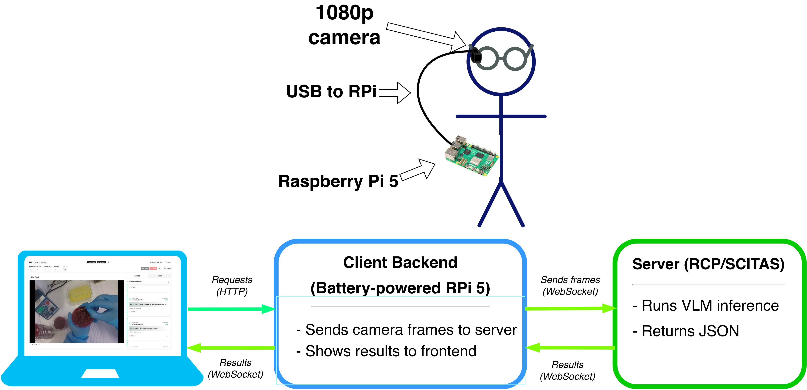
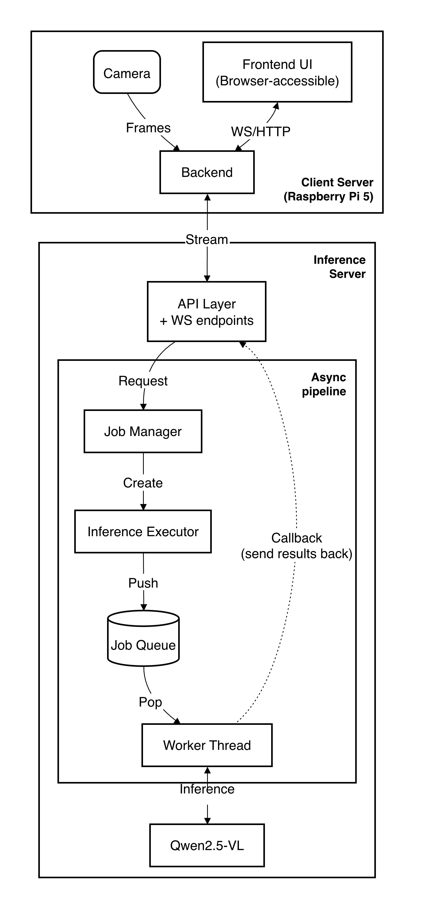
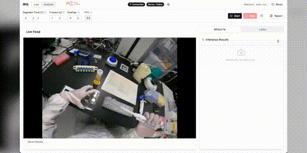
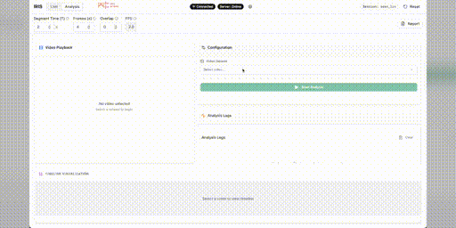

# IRIS: Intelligent Recognition and Interpretation System

> Vision-language models for automated laboratory workflow documentation  
> Semester Project | EPFL AI Team | Fall 2025

A research collaboration between [Annaelle Myriam Benlamri](https://github.com/AnnaelleMyriam) (MSc Data Science) and [Marcus Hamelink](https://github.com/animarcus) (BSc Computer Science), supervised by Prof. Andrea Cavallaro.

**Presented at**: [AMLD 2026](https://appliedmldays.org/) | **Project Page**: [epflaiteam.ch/projects/iris](https://epflaiteam.ch/projects/iris)

---

## Overview

Manual documentation in laboratories is a tedious and error-prone task. IRIS addresses this by equipping researchers with a wearable camera that streams first-person video to a remote server, where a vision-language model generates structured logs of the procedure in near real-time.

The project was developed in two parallel research tracks, both using Qwen2.5-VL as a foundation but exploring different strategies for making it understand laboratory actions. The system was demonstrated on colony counting workflows at CHUV (Lausanne University Hospital), a procedure where researchers typically process over 30 petri dishes at a time, counting and manually transcribing results across hours of repetitive work.

The code for each track lives in [`sft-vlm-finetune/`](sft-vlm-finetune/) (Marcus) and [`vlm_fusion/`](vlm_fusion/) (Annaelle), with the demo pipeline in [`src/iris/`](src/iris/).

<p align="center">
  
</p>

---

## Research Contributions

### Action Recognition and Multimodal Fusion - Annaelle Myriam Benlamri

Investigated specialized video action recognition models and two strategies for integrating them with a VLM, evaluated on the [FineBio Dataset](https://github.com/aistairc/FineBio).

- **Backbone**: VideoMAE V2 (ViT-Base distilled from ViT-Giant, https://huggingface.co/OpenGVLab/VideoMAE2/tree/main/distill), pretrained on 1.35M unlabeled clips and fine-tuned on the processed FineBio dataset.
- **Fusion strategy 1, Prompt injection**: Top-k predicted actions from VideoMAE V2 are formatted as structured context and injected into Qwen2.5-VL's prompt
- **Fusion strategy 2, Deep fusion**: VideoMAE V2 spatiotemporal tokens are compressed via a Perceiver Resampler and projected directly into Qwen2.5-VL's embedding space via a trainable MLP, with both backbones frozen

- **Report**: [`Annaelle-Benlamri-IRIS-VLM-Report.pdf`](https://github.com/EPFL-AI-Team/IRIS/blob/main/Annaelle-Benlamri-IRIS-VLM-Report.pdf)
- **Code**: [`vlm_fusion/`](vlm_fusion/)
- **Models on HuggingFace**: [videomaev2-finetuned-finebio](https://huggingface.co/AnnaelleMyriam/videomaev2-finetuned-finebio), [videomae-qwen-connectors](https://huggingface.co/AnnaelleMyriam/videomae-qwen-connectors)

---

### VLM Fine-tuning and End-to-End Pipeline - Marcus Hamelink

Built the full streaming pipeline from hardware to inference server, and fine-tuned Qwen2.5-VL (3B) via supervised fine-tuning on the FineBio dataset for structured laboratory action description.

- **Pipeline**: Raspberry Pi 5 client (camera capture and WebSocket streaming) to a FastAPI inference server (async producer-consumer queue) with a React frontend showing live results and session management
- **Fine-tuning**: LoRA (r=16, alpha=32) on 9K stratified FineBio samples, trained to output structured JSON descriptions of laboratory actions
- **Two operational modes**: live streaming with a few seconds of inference latency, and batch analysis of pre-recorded video with automated report generation

<p align="center">
  
</p>

- **Report**: [`Marcus-Hamelink-IRIS-VLM-Report.pdf`](Marcus-Hamelink-IRIS-VLM-Report.pdf)
- **Model on HuggingFace**: [animarcus/iris-qwen2.5-vl-3b-finebio](https://huggingface.co/animarcus/iris-qwen2.5-vl-3b-finebio)
- **Inference server**: [`src/iris/server/`](src/iris/server/)
- **Client backend and frontend**: [`src/iris/client/`](src/iris/client/)
- **VLM fine-tuning**: [`sft-vlm-finetune/`](sft-vlm-finetune/) — dataset prep, training scripts, evaluation

---

## Application Demo

Live mode streams from the camera in real-time, with results appearing as inference completes. Analysis mode runs on a pre-recorded video, producing a timeline visualization and a generated report of the procedure.

<p align="center">
  
  &nbsp;
  
</p>
<p align="center">
  <em>Left: live documentation mode. Right: analysis mode with timeline and report generation.</em>
</p>

---

## Quick Start

The system is designed to run with the inference server on a GPU machine (the project used EPFL's Izar and RCP clusters) and the client on a local machine or Raspberry Pi. It can be run fully locally if the machine has sufficient GPU memory to load the model.

```bash
git clone https://github.com/EPFL-AI-Team/IRIS
cd IRIS
uv sync

# Terminal 1 - inference server (GPU required)
uv run iris-server

# Terminal 2 - client and web interface
uv run iris-client
```

Web interface available at `http://localhost:8006`. For full setup, configuration options, and Raspberry Pi instructions, see [docs/setup.md](docs/setup.md).

---

## Documentation

| Document                                       | Description                                           |
| ---------------------------------------------- | ----------------------------------------------------- |
| [docs/setup.md](docs/setup.md)                 | Local setup and Raspberry Pi configuration            |
| [docs/cluster-setup.md](docs/cluster-setup.md) | Running on EPFL Izar and RCP clusters                 |
| [docs/rcp-guide.md](docs/rcp-guide.md)         | VLM training, evaluation, and inference CLI reference |
| [docs/API.md](docs/API.md)                     | REST and WebSocket API reference                      |
| [sft-vlm-finetune/](sft-vlm-finetune/)         | VLM fine-tuning — dataset prep, training, evaluation  |
| [vlm_fusion/](vlm_fusion/)                     | Action recognition and deep fusion architecture       |

---

## Acknowledgments

- **Supervisor**: Prof. Andrea Cavallaro (EPFL AI Team)  
- **Track Lead**: Louis Vasseur (EPFL AI Team)  
- **Domain expertise and videos**: CHUV (Lausanne University Hospital)

---

**License**: Apache 2.0
